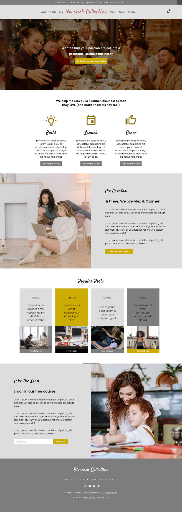

## DESCRIPTION:
a Creative Agency website created with React + styled component.

## OUTCOME:
Getting my hands dirty building UI in React + getting used to styling with css-in-js with Styled Components.

## TECH STACKS:
- React
- Styling with: Styled Component.

## PROGRESS:
- Done: 95%; (because it's not mobile-friendly)

## How to run
`npm install`
`npm start`

## IMAGE:

